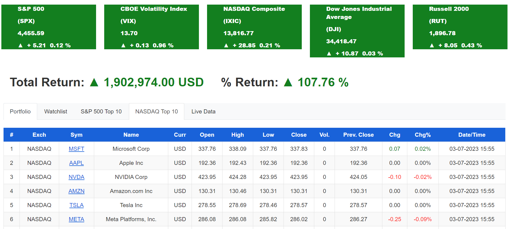

# Tradeus: A Stock Tracker App

## Introduction
Tradeus is a stock tracker app, with features that distinguishes it from other typical stock tracker apps. It is hosted live on https://tradeus.tech

Some exciting implementations in Tradeus include charting, creation of watch list and ability to create personal portfolios which displays real time update of stock profits calculated using both annualised and total profits. 

It is built with Angular(frontend), Spring Boot (backend) with SQL, Redis and MongoDB as databases. More details are available at my portfolio project site https://ngchinling.com/projects/stocktracker.html

### Technology
- Angular *Typescript*
- Spring Boot *Java*
- Chart JS *Javascript*
- ngBootStrap and Bootstrap 
- Java Mail
- Web Sockets
- Stripe E-payment

### Using Tradeus
Although the codes are available for your perusal, the app requires the use of environment variables and keys from the financial data service provider. 

### Features
- Email: The app sends an email notification to the user when there is a new  sign-up or when the user logs in. (Try it with an authentic email address)
- Web Socket: Used in getting live data from external financial data firm. See feature in 'live data' tab of dashboard page

### Video

